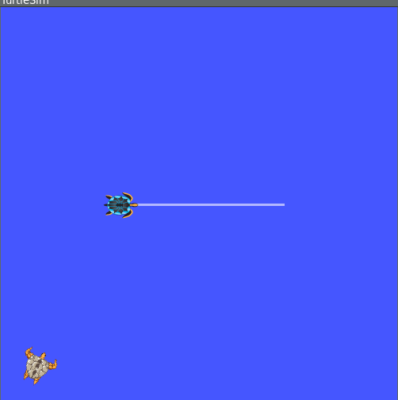
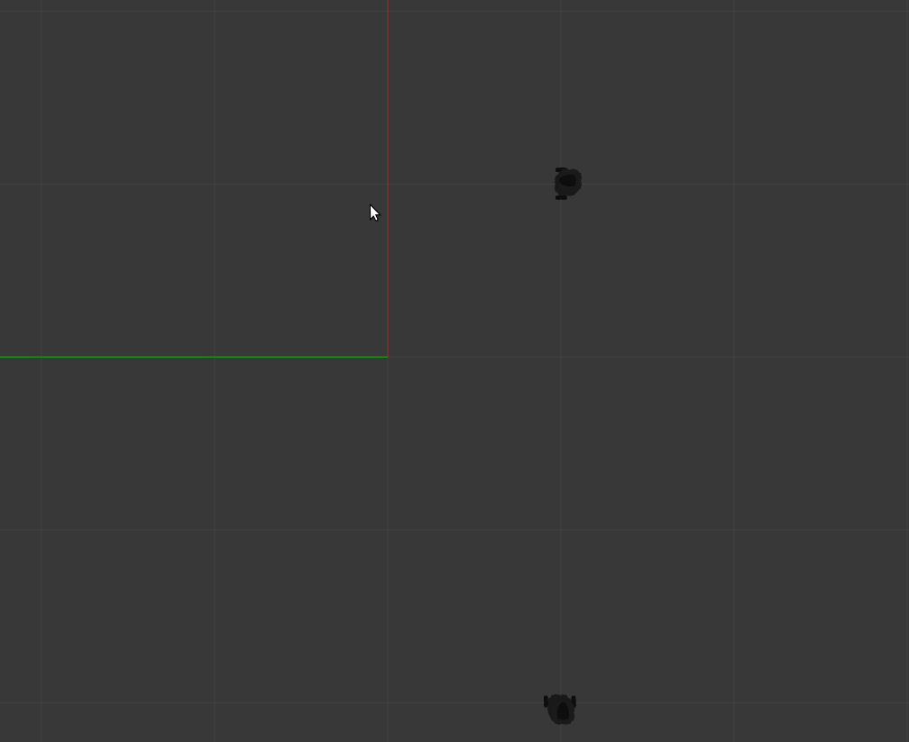

# Compiling the project
In order to compile this code, clone this project into your catkin workspace src directory and then run catkin_make. You might want to source devel/setup.zsh to see the new nodes added.
```
cd <your catkin ws>/src
git clone <project url>
catkin_make
source devel/setup.[bash/zsh/sh] depending on your shell
```

# Running the project
In order to run the project and see the turtle self-align, do the following:

```
roslaunch auto-align-turtlesim turtlesim.launch
```
#### Output
THe above program gives the following output:



----------------------------------------------------------
If you have gazebo and turtlebot installed:
```
roslaunch auto-align-turtlesim multi_turtlebot.launch
```


Currently, this project only supports alignment for two turtlebots or two turtles in a simulator, however, 
we can extend this functionality to different types of bots too.

### Instructions to create a new robot:
- Inside src/robots directory create a new class <MyCustomRobot> as follows:
  
```
class MyCustomRobot(Base):
  def __init__(self, turtle_name, pose_topic_substr=<POSE_SUBSTR>, vel_topic_substr=<POSE_SUBSTR>, pose_msg_type=<POSE_TYPE>,
                 vel_msg_type=<VEL_TYPE>, namespace=<NAMESPACE>):
        super().__init__(turtle_name, pose_topic_substr, vel_topic_substr, pose_msg_type, vel_msg_type, namespace)
        
 def get_position_coordinates(self):
      <Should return turtlesim_msg.Pose object>
 
 def  create_alignment_msg(self, dest_pose_msg):
      <should return a msg of type VEL_TYPE>
 
 def spawn():
      how to spawn the robot
```
- Create a new executable  bin/<MyCustomRobotSimulation>

```
# Initialize and spawn the turtles
src = Turtlebot('tb3_0')
dest = Turtlebot('tb3_1')

# Initialize the controller
controller = Controller(src, dest)
controller.simulate()
```
- Create a launch file for your robot. The launch file should spawn the two robots as there is no special mechanism for spawning. You can call the spawn function inside the main executable, however, this feature hasn't been tested yet.
- Update CMakeLists.txt.
```
catkin_install_python(
  PROGRAMS bin/turtlesim_align bin/turtlebot_align
  DESTINATION ${CATKIN_PACKAGE_BIN_DESTINATION}
)
```
- Compile and execute your launch file similar to the process discussed in the beginning.
